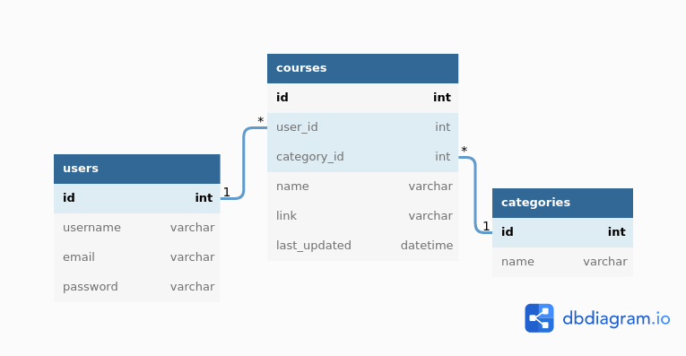

# Docs Summary
- [DB Entity Relationship Diagram](#db-entity-diagram)

- [EndPoints](#endpoints)
  - [Auth Endpoints](#auth-endpoint)
    - [Login](#login-route)
    - [Register](#login-route)
  - [Courses Endpoints](#courses-endpoint-auth-needed)
    - [All Courses](#all-courses)
    - [Course by Id](#find-course-by-id)
    - [Save Course](#save-course)
    - [Edit Course](#edit-course)
    - [Delete Course](#delete-course)


# DB Entity Relationship Diagram


# Endpoints

## Auth EndPoint

### Register Route

```
Post /auth/register
```
Request Body:
```json
{
  "email": "example@email.com",
  "username": "YourUser",	
  "password": "YourPassword"
}
```
response status: 
```
201 created
```

## Login Route

```
Post /auth/login
```
Request body:
```json
{
  "username": "YourUser",	
  "password": "YourPassword"
}
```

Response: 
```json
{
  "token": "(generated token)"
}
```
# Courses Endpoint (Auth Needed)

## All courses
```
GET /courses
```
request Header: 
```
Authorization: Bearer (token)
```
response: 
```json
[
  {
	  "id": 1,
	  "user_id": 2,
	  "name": "Course Name",
	  "link": "https://course.com",
	  "category": "tech",
	  "category_id": 1
  }
]
```

## Find course by id
```
GET /courses/{id}
```
request Header: 
```
Authorization: Bearer (token)
```
response: 
```json
{
  "id": 1,
  "user_id": 2,
  "name": "Course Name",
  "link": "https://course.com",
  "category": "tech",
  "category_id": 1
}

```

## Save course
```
POST /courses
```
request Header: 
```
Authorization: Bearer (token)
```
Request Body:  
```json
{
  "name": "Course Name",
  "link": "https://course.com",
  "category": "tech"
}
```
response status: 
```
201 created
```

## Edit Course
```
PUT /courses
```
request Header: 
```
Authorization: Bearer (token)
```
Request Body:  
```json
{
  "id": "1",
  "name": "New Course Name",
  "link": "https://course.com",
  "category": "tech"
}
```
response status: 
```
200 success
```

# Delete course
```
DELETE /courses/{id}
```
request Header: 
```
Authorization: Bearer (token)
```
response status: 
```
200 success
```
